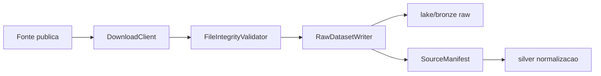

# Bronze Ingestion

## Objetivo

A camada bronze preserva arquivos publicos exatamente como coletados, com hash, tamanho, origem, periodo de referencia, cobertura territorial, status e manifesto. Ela nao normaliza schema, encoding ou chaves de negocio; essas etapas pertencem a silver.

## Componentes

- `BaseIngestionJob`: orquestra download, validacao, escrita raw, manifestos e relatorio.
- `DownloadClient`: baixa HTTP/HTTPS com retries ou copia arquivo local para testes/reprocessamento.
- `FileIntegrityValidator`: valida existencia, tamanho minimo e hash esperado.
- `RawDatasetWriter`: grava em `lake/bronze`, deduplica por SHA-256 e gera `SourceManifest`.
- `IngestionReport`: relatorio de execucao do job.
- `SourceManifest`: evidencia auditavel por arquivo coletado.

## Layout

Os arquivos raw seguem:

```text
lake/bronze/{fonte}/{dataset}/{ano}/{uf}/ingested_at={timestamp}/{hash}_{nome_original}
```

Os manifestos seguem:

```text
lake/manifests/bronze/{fonte}/{dataset}/{ano}/{uf}/run_id={run_id}/manifest.json
```

Falhas geram:

```text
lake/manifests/bronze/{fonte}/{dataset}/{ano}/{uf}/run_id={run_id}/failure.json
```

## Datasets Iniciais

TSE:

- `tse.boletim_urna`
- `tse.eleitorado_secao`
- `tse.eleitorado_local_votacao`
- `tse.candidatos`
- `tse.prestacao_contas`

IBGE:

- `ibge.malha_setores`
- `ibge.agregados_censo`

Conectores preparados:

- `theme.ssp_sp_criminalidade`
- `theme.cnes_municipio`

## Execucao

Download remoto:

```powershell
python scripts/run_bronze_ingestion.py --dataset tse.boletim_urna --ano 2024 --uf SP
```

Arquivo local para teste ou reprocessamento:

```powershell
python scripts/run_bronze_ingestion.py --dataset tse.boletim_urna --ano 2024 --uf SP --local-path tmp/sample.zip
```

Validacao por hash esperado:

```powershell
python scripts/run_bronze_ingestion.py --dataset ibge.malha_setores --ano 2022 --uf SP --expected-sha256 <sha256>
```

## Politica Operacional

- Deduplicacao e feita por SHA-256 dentro de cada par fonte/dataset.
- Arquivos duplicados nao sao copiados novamente; o manifesto aponta `duplicate_of`.
- Todo job gera `report.json`, mesmo em falha.
- Toda falha gera `failure.json` com erro e contexto de coleta.
- Downloads remotos usam retries com backoff.
- A cobertura temporal e territorial fica explicita em `reference_period`, `ano`, `uf` e `municipio`.

## Lineage

Bronze gera evidencia para silver:



## LGPD

A bronze preserva fontes publicas oficiais, mas ainda assim registra sensibilidade no catalogo enterprise. Dados pessoais publicos de candidatos e prestacao de contas devem ser minimizados na promocao para silver/gold e nunca aparecer em logs alem de identificadores operacionais controlados.
