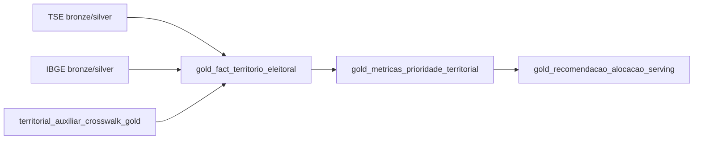

# Enterprise Data Catalog

## Diagnostico

O projeto ja possuia um catalogo inicial em `data_catalog/sources.py`, focado em fontes prioritarias para ingestao. Esse formato era util para pipeline, mas ainda nao respondia de forma operacional as perguntas de produto, comercial e governanca:

- quais dados existem e em qual granularidade real;
- qual fonte sustenta cada funcionalidade;
- qual confianca pode ser atribuida a cada join;
- quais lacunas ainda bloqueiam o uso comercial;
- quais datasets alimentam scoring, recomendacao e explicabilidade.

Esta entrega adiciona um catalogo enterprise separado, preservando compatibilidade com o catalogo legado.

## Arquitetura

Arquivos principais:

- `data_catalog/models.py`: contratos Pydantic para datasets enterprise, cobertura, qualidade, dependencias, metadados tecnicos e metadados de negocio.
- `data_catalog/enterprise_registry.py`: registry tipado com os datasets priorizados para o produto.
- `data_catalog/enterprise_io.py`: leitura e escrita JSON do catalogo e da tabela de priorizacao.
- `data_catalog/catalog.enterprise.json`: snapshot operacional do catalogo.
- `data_catalog/prioritization.enterprise.json`: tabela consumivel por produto/comercial/dados.

## Modelo de Dataset

Cada dataset enterprise registra:

- `dataset_id`, nome, descricao, fonte e URL;
- formato e camada alvo (`bronze`, `silver`, `gold`);
- granularidade real;
- periodicidade e estrategia de atualizacao;
- chave primaria e possiveis chaves estrangeiras;
- cobertura temporal e geografica;
- sensibilidade LGPD;
- prioridade de produto e status de ingestao;
- observacoes de join e score de confiabilidade;
- regras de qualidade;
- dependencias e lineage;
- capacidades de produto suportadas.

## Classificacao de Produto

O catalogo classifica datasets pelas capacidades:

- `contexto_candidato`
- `forca_eleitoral`
- `competicao`
- `eficiencia_gasto`
- `tematica_territorial`
- `capacidade_operacional`

Essa taxonomia permite explicar por que uma base existe e qual parte do produto ela sustenta.

## Priorizacao

| Impacto | Criterio operacional | Exemplos |
| --- | --- | --- |
| critical | Tier 1 com prioridade >= 90 | boletim de urna, resultados por secao, crosswalk, fato territorial, recomendacao |
| high | prioridade >= 75 | censo agregado, malha censitaria, contexto territorial |
| medium | prioridade >= 55 | CNES, Censo Escolar, Siconfi, SSP-SP, Meta Ads |
| low | prioridade < 55 | sinais digitais auxiliares em revisao |

## Governanca e LGPD

Regras aplicadas:

- dados de eleitorado sao tratados somente em forma agregada por territorio;
- fontes com dados pessoais publicos recebem classificacao `public_open_data_personal`;
- fontes digitais com risco de vies ou perfilamento recebem `manual_review_required`;
- outputs operacionais de campanha recebem `campaign_operational_confidential`;
- nenhum dataset do catalogo autoriza microtargeting individual ou inferencia de preferencia politica individual.

## Qualidade

Todo dataset declara regras minimas:

- schema obrigatorio;
- unicidade da chave primaria;
- atualizacao dentro da periodicidade esperada.

Datasets gold tambem precisam declarar dependencias e documentacao de negocio. Isso evita tabelas analiticas sem lineage claro.

## Lineage

O fluxo canonico e:



## Lacunas Atuais

Lacunas marcadas no catalogo:

- malha censitaria e agregados do Censo 2022 ainda precisam ingestao production-ready;
- gastos eleitorais possuem atribuicao territorial parcial;
- Meta Ad Library tem gasto por faixa e matching candidato/pagina probabilistico;
- sinais digitais agregados exigem revisao humana antes de uso comercial;
- joins geoespaciais entre local de votacao e setor censitario devem manter `join_confidence`.

## Uso

Carregar catalogo:

```python
from pathlib import Path

from data_catalog.enterprise_io import read_enterprise_catalog

catalog = read_enterprise_catalog(Path("data_catalog/catalog.enterprise.json"))
```

Listar lacunas:

```python
from data_catalog.enterprise_registry import catalog_gaps

gaps = catalog_gaps()
```

Filtrar por capacidade de produto:

```python
from data_catalog.enterprise_registry import datasets_by_product_capability

datasets = datasets_by_product_capability("forca_eleitoral")
```

## Risco de Modelagem

O maior risco analitico esta em joins aproximados:

- TSE para IBGE: deve preferir codigo exato e registrar fallback por nome normalizado.
- Local de votacao para setor censitario: join geoespacial, nao deterministico.
- Gasto eleitoral para territorio: muitas despesas nao possuem territorio confiavel.
- Meta Ads para candidato: depende de pagina declarada, evidencia publica ou revisao manual.

Esses riscos devem aparecer em score de confianca, explicabilidade e relatorios comerciais.
