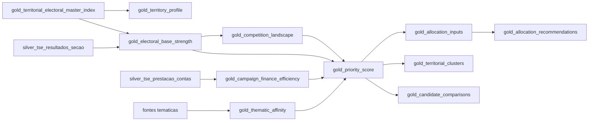

# Gold Analytical Marts

## Objetivo

A camada gold transforma o Master Index e as tabelas silver em ativos analiticos prontos para produto. Cada mart tem definicao de negocio, grain, metricas, lineage, politica de refresh, consumidores e checks de qualidade.

## Tabelas

| Tabela | Grain | Finalidade |
| --- | --- | --- |
| `gold_candidate_context` | `candidate_id` | contexto consolidado do candidato |
| `gold_territory_profile` | `ano_eleicao + uf + cod_municipio_tse + zona` | perfil operacional do territorio |
| `gold_electoral_base_strength` | `candidate_id + territorio_id` | forca de base eleitoral |
| `gold_competition_landscape` | `territorio_id` | competicao local |
| `gold_campaign_finance_efficiency` | `candidate_id` | eficiencia de gasto |
| `gold_thematic_affinity` | `territorio_id + tema` | aderencia tematica territorial |
| `gold_priority_score` | `candidate_id + territorio_id` | priorizacao territorial |
| `gold_allocation_inputs` | `candidate_id + territorio_id` | entrada para simulador |
| `gold_allocation_recommendations` | `scenario_id + candidate_id + territorio_id` | recomendacao de alocacao |
| `gold_territorial_clusters` | `territorial_cluster_id` | clusters territoriais |
| `gold_candidate_comparisons` | `territorio_id` | comparativos entre candidatos |

## Lineage



## Formula Inicial de Priorizacao

```text
score_prioridade_final =
0.30 * base_strength_score
+ 0.20 * thematic_affinity_score
+ 0.15 * potencial_expansao_score
+ 0.15 * finance_efficiency_score
+ 0.10 * competition_score
+ 0.10 * data_quality_score
```

Essa formula e pragmatica e deve ser externalizada por tenant quando a configuracao estrategica estiver madura.

## Execucao

```powershell
python scripts/build_gold_marts.py `
  --master-index lake/gold/territorial_electoral_master_index/territorial_electoral_master_index_2024_sp_v1.parquet `
  --electoral-results lake/silver/tse_resultados_secao/tse_resultados_secao.parquet `
  --campaign-finance lake/silver/tse_prestacao_contas/tse_prestacao_contas.parquet `
  --thematic-signals lake/silver/thematic_signals/thematic_signals.parquet `
  --dataset-version 2024_sp_v1 `
  --budget-total 50000 `
  --scenario-id baseline
```

## Saidas

```text
lake/gold/marts/{dataset_version}/{table_name}/{table_name}.parquet
lake/gold/marts/{dataset_version}/{table_name}/manifest.json
lake/gold/marts/{dataset_version}/gold_marts.duckdb
lake/gold/marts/{dataset_version}/duckdb_examples.sql
```

## Exemplos DuckDB

```sql
SELECT candidate_id, territorio_id, score_prioridade_final, score_explanation
FROM gold_priority_score
ORDER BY score_prioridade_final DESC
LIMIT 20;
```

```sql
SELECT scenario_id, candidate_id, territorio_id, recurso_sugerido, justificativa
FROM gold_allocation_recommendations
ORDER BY recurso_sugerido DESC;
```

## Checks de Qualidade

Cada manifest registra:

- numero de linhas;
- schema efetivo;
- definicao de negocio;
- metricas da tabela;
- lineage;
- checks declarados;
- min/max/nulls para colunas de score.

## Limites

- `gold_campaign_finance_efficiency` nao atribui gasto a secao sem evidencia territorial.
- `gold_thematic_affinity` aceita sinais agregados; nao deve inferir preferencia individual.
- `gold_allocation_recommendations` e saida de decisao agregada, nao microtargeting individual.
